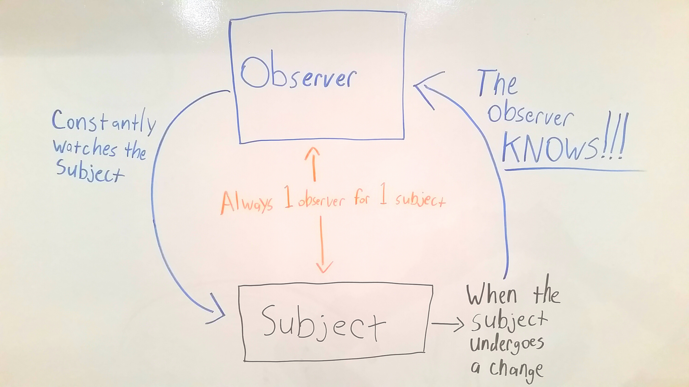

##Backbone Primer

---

##Key Concept - Observers and Subjects

**Subject**: A subject can be any object that we create within our code. In Backbone, we will make specific objects and designate them as subjects. More on that later!

**Observer**: An observer is something that watches a subject. When the subject is changed, the observer is automatically notified.
- Observers and Subjects have a 1 to 1 relationship. Meaning that each observer will only ever watch one subject. *This idea of 1 observer and 1 subject is crucial*

**Why is this important?**
  - This is important because we can have an observer watch a subject and automatically run pieces of code when the subject is changed.

Diagram:
  

**What does this have to do with Backbone?**
*Using observers and subjects, Backbone allows us to automatically update the DOM when changes are made to our data.*

**Whoa, what does that even mean?**
  - Lets think about our app that CRUD'ed puppies.
  - We had a page with a list of every puppy
  - We can think of the puppies list as our data because it contains the name and color of each of the puppies.
  - We were displaying this data as a `<ul>` with an `<li>` for each puppy.
  - Backbone allows us to hold this data in a  Javascript object instead of just inside a `<ul>` in HTML
  - Then if any of the data is changed (ex. if a puppy's name has been updated), the `<li>` element on the DOM for that puppy will automatically update to displaying the new puppy name.

##Backbone Terminology
- ***Model***: A model is the underlying data in a Backbone application.
  - In the case of our puppies app, there would be one model object each puppy. This model would hold their attributes - `name`, `color`
- ***View***: A view is the graphical representation of what a model looks like
  - In the case of our puppies app, each model has its own view.
  - This means that our model for the first puppy has corresponding `<li>` which is it's view, the model for the second puppy has a corresponding `<li>` which is it's view, and so on and so forth.
- ***Collection***: A collection is just an ordered set of models. Basically, its an array that contains all of your models.
- ***Router***: A router is used for routing your applications URL's.

##Backbone + Observers and Subjects

Great, now we have learned some terminology but how does this relate to the idea of observers and subjects?

We learned earlier that observers watch subjects and execute some code when the subject is changed.

**In Backbone, our Models are thought to be the Subjects and our Views are thought to be the observers**
  - When a model (puppy 1) has his name updated, the view (puppy 1s `<li>`) is automatically notified so that the `<li>` can update it's HTML to show his new name.
