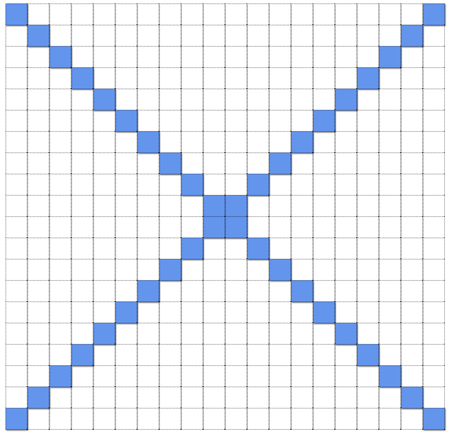

# Paint by Numbers

### Do

Record the code you used to solve each of the following in a file in today's `Homework` folder.

* Fill in 10 random cells.
  - [Math.random](https://developer.mozilla.org/en-US/docs/Web/JavaScript/Reference/Global_Objects/Math/random)
* Write code which diagonally paints the grid from corner to corner
  
* Checkerboard the whole grid - black and white alternating
  

### Reflect

Think of three real life situations and break them down into pseudocode. Each example should use at least one conditional and at least one of the examples should include a loop. Write your responses in today's `Homework` folder.

Example: Walking down the street.

```
loop
  if left foot extended
    extend right foot
  else
    extend left foot
```

What was challenging about this exercise? How did you decide what level of detail to go into in terms of your `statements`.

### Go Further [Challenging]

We have just invented a new programming language called *griddy*. Griddy syntax follows the form: `fill in NUM cells with the color COLOR starting at X, Y`

Where
* NUM is the number of cells they want filled
* COLOR is their color choice
* X, Y are the starting coordinates

Assume the user knows griddy and use `prompt` to ask the user for a griddy command. Then, carry out their wishes by filling in the appropriate cells.

Prompting Questions:

1. Why did we have to define a syntax? What is the point of this??!!
* What are some simple ways you could check if syntax of the user's response is correct?
* Are there any unnecessary symbols in griddy's syntax? Is there another way we could write this? Feel free to mess around with the syntax to your liking.

Resources:

* https://developer.mozilla.org/en-US/docs/Web/JavaScript/Reference/Global_Objects/String/split

**Super Bonus**

* Add a new type of command, `alternate` which allows the user to say something like: `alternate 10 cells with COLOR1 COLOR2 starting X, Y` that alternates colors
* How could you redefine the syntax to allow for commands that call for filling in whole rows or columns?