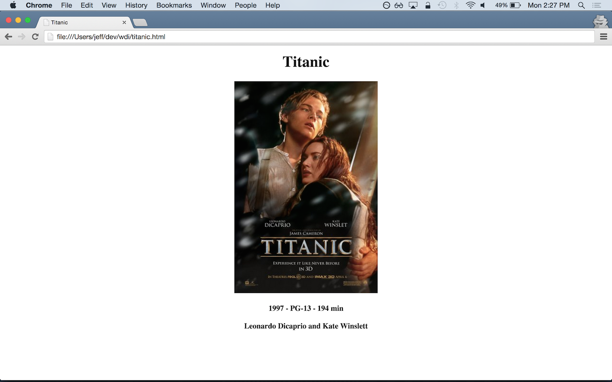

# Müvie Haus

You have just been hired by a small independent movie house, appropriately named - Müvie Haus. What follows is a description of his problem and requirements for a solution.

## Problem

Müvie Haus's owner, Gerard Von Schtieffel, needs a way of creating informative posters to display on his cinema's website for each movie that is playing.

He doesn't know how to write HTML, but he does know how to run node apps on the command line (go with it). He has asked you to create a command line application that can quickly generate HTML posters for all of the movies playing currently so he doesn't have to hire someone to build them manually.

## Requirements

* Gerard must easily be able to edit the list of movies that are playing at the cinema because he is constantly changing the lineup. *He must be able to do this without editing the javascript application code!*
* Each poster must contain the following information - the title, runtime, rating (ie, R, PG-13), year of release, and two actors who are in the film.
* Further, a poster should display an image of the actual movie poster for the film.

Example:



## Spec

Step one for you, the developer, is to create a spec. This should follow the form we have been practicing in class.

* User can add two numbers together
```bash
  node add.js 1 2
  3
```

Use this as an opportunity to get very precise about how this application will work. Take Gerard's requirements into account, and consider the following questions:

* Where will data be stored? 
* How will it be accessed? 
* Where is the poster going to go, and how is it going to be generated?
* What happens if there is bad user input or messy data?
* What else needs to be thought of?

## Build

If, and only if, you have completely spec-ed out the application as a list of "User can " do statements and examples, then proceed to building. As always, take it one step at a time and ABBID (always be breaking it down).

## Criteria

1. Precise and well-documented feature specs. [1 - 5]
2. App requirements fulfilled [1 - 5]
3. Variables and function names are semantic [1 - 5]
