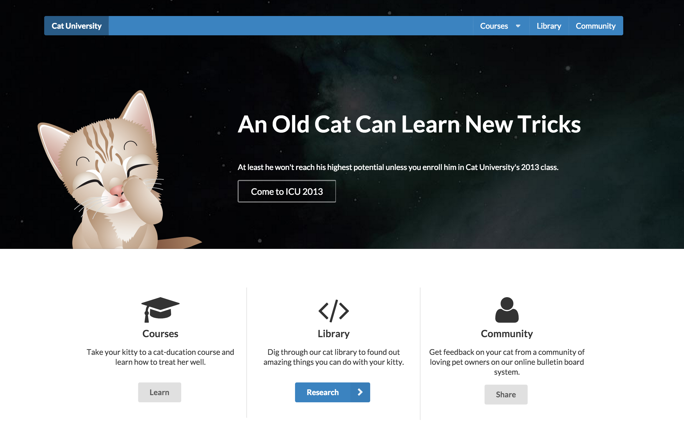

#Semantic UI

> <a href="http://semantic-ui.com/"> Semantic UI </a> is a framework that helps us create visually appealing and responsive web applications.

Tonight, we are going to use Semantic UI to "dress up" our simple puppy-CRUD application from last week.

We've updated the code for the application to add a few features. Users can now input images for each puppy they add. The database has been modified to accommodate this.

**Disclaimer**

Some of the fancier features used by Semantic UI rely on client-side Javascript and JQuery, and we don't want to use those quite yet. If the example code for something to implement includes Javascript, skip it for now. If you see anything using a `$`, skip it.

Requirements:
- Semantic UI has tons of features to choose from. Try to incorporate the following into your application:

**Landing Page**
  - Start off by adding a nice landing page to the application (at the `GET /` route).
    - We want a nice banner going across the top, with 3 tiled links at the bottom, one for adding puppies, one for listing all puppies, and one for the about page.
    - *Tip*: Use the grid, buttons, icons provided by Semantic UI.
    - *Sample*:
    

**Rest of Application**
  - Use a simple [dropdown menu](http://semantic-ui.com/modules/dropdown.html) for navigation. Or use a side menu, like jeff showed!
    - *Tip*: Note the download button at the top of the link. Dropdowns are not included in Semantic UI by default. However, if you click `Download`, then click `Choose` under 'Standalone', you will see that you can easily npm install it!
    - A user should be able to choose between the form for creating puppies, listing them all, the about page, or back to the landing page.
  - We want to display all our puppies as a [list](http://semantic-ui.com/elements/list.html), try being a little creative with how you display the list items.
  - Try using [ribbon labels](http://semantic-ui.com/elements/label.html#ribbon) on a puppy's show page.
    - *Tip*: Labels are also not included in the standard Semantic UI download. You will have to install it.
  - Use a breadcrumb on your page to let users know where they are.
  - Explore using <a href="http://semantic-ui.com/views/card.html">cards</a> for displaying your dogs
    - *Tip*: Cards are also not included in the standard Semantic UI download. You will have to install it.
